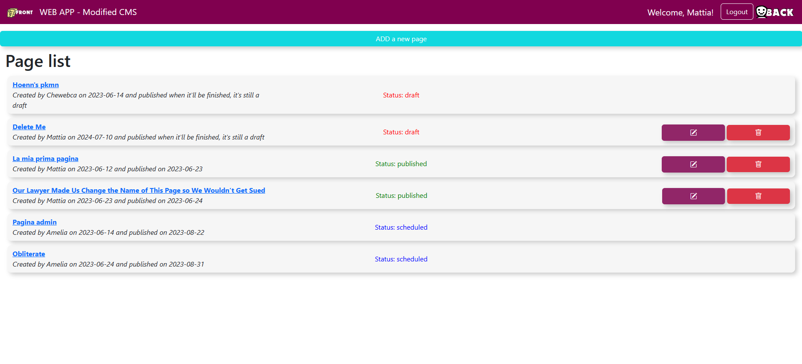
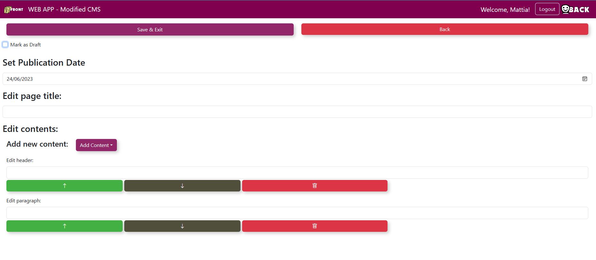

[](https://classroom.github.com/a/8AapHqUJ)
# Exam #1: "CSM Small"
## Student: s308786 OLIVA MATTIA 

## React Client Application Routes

- Route `/`: home page, it's the front office. Displays the list of published pages for both authenticated and not authenticated users
- Route `/pages/:pageId`: renders the page with the ID 'pageId', loading all of its components. Accessible by all users
- Route `/login`: displays a form to execute the login (email and password as credentials)
- Route `/back-office`: displays the list of all pages to logged-in users and allows to add new and modify your owns (or any page for admins)
- Route `/back-office/title`: allows a logged admin to set the website title (shown in the navbar)
- Route `/back-office/pages/:pageId/edit`: allows to edit the page 'pageId' by the author or an admin
- Route `/back-office/pages/add`: allows a logged user to add a new page 
- Route `*`: generic wrong path page

## API Server

### User management

#### Login
- POST `/api/sessions`
  - Description: authenticates the user who is trying to login
  - Request parameters: _None_
  - Request body: credentials of the user who is trying to login
``` JSON
{
    "username": "user@email.com",
    "password": "password"
}
```

  - Response body: authenticated user
``` JSON
{
    "id": 1,
    "username": "user@email.com", 
    "name": "T. Ester",
    "role": "standard"
}
```
  - Error responses:  `500` (generic server error), `401` (login failed)

#### Check if user is logged in
- GET `/api/sessions/current`
  - Description: checks if current user is logged in and get their data
  - Request parameters: _None_
  - Request body: _None_
  - Response body: authenticated user
``` JSON
{
    "id": 1,
    "username": "user@email.com", 
    "name": "T. Ester",
    "role": "standard"
}
```
  - Error responses: `401` (login failed)

#### Logout
- DELETE `/api/sessions/current`
  - Description: logs out current user
  - Request parameters: _None_
  - Request body: _None_
  - Response body: _None_

### Title management

#### Retrieve title
- GET `/api/title`
  - Description: return the latest saved title of the app
  - Request parameters: _None_
  - Request body: _None_
  - Response body: the latest title
``` JSON
{
    "title": "the newest title"
}
```
  - Error responses:  `500` (generic server error)

#### Set a new  title
- POST `/api/title`
  - Description: sets a new title for the app
  - Request parameters: _None_
  - Request body: the new title and the author admin's name
``` JSON
{
    "title": "the newest title",
    "author": "Amelia"
}
```
  - Response body: the latest saved title
``` JSON
{
    "title": "the newest title"
}
```
  - Error responses:  `503` (database error), `401` (not authorized), `422` (unprocessable entity)


### Page management

#### List all the existing pages
- GET `/api/pages`
  - Description: returns all the pages if the user is logged in, otherwise only the already published ones
  - Request parameters: _None_
  - Request body: _None_
  - Response body: a list of pages
``` JSON
{
    "pagelist":[
      {
        "id": 1,
        "title":"HTTP-ed page",
        "author":"Mattia",
        "creationDate":"2023-06-24", 
        "publicationDate":"2023-06-25"
      },
      {
        "id":2,
        "title":"New page",
        "author":"Eric",
        "creationDate":"2023-06-24", 
        "publicationDate":null
      }
    ]
}
```
  - Error responses:  `500` (generic server error)

#### Create a new page
- POST `/api/pages`
  - Description: creates a new page
  - Request parameters: _None_
  - Request body: the data of the new page to insert
``` JSON
{
    "title":"HTTP-ed page",
    "author":"Mattia",
    "creationDate":"2023-06-24", 
    "publicationDate":"2023-06-25"
}
```
  - Response body: the id of the newly inserted page
``` JSON
{
    "newId":1
}
```
  - Error responses:  `503` (database error), `401` (not authorized), `422` (unprocessable entity), `404` (page not found)

#### Update a page
- PUT `/api/pages/:pageID`
  - Description: updates a pre-existing page
  - Request parameters: the id of the page to update
  - Request body: the updated data
``` JSON
{
    "id":1,
    "title":"HTTP-ed page",
    "author":"Mattia",
    "creationDate":"2023-06-24", 
    "publicationDate":"2023-06-25"
}
```
  - Response body: _None_
  - Error responses:  `503` (database error), `401` (not authorized), `422` (unprocessable entity), `404` (page not found)

#### Delete a page
- DELETE `/api/pages/:pageID`
  - Request parameters: the id of the page to delete
  - Request body: _None_
  - Response body: _None_
  - Error responses:  `503` (database error)

### Content management

#### List all the contents of a pages
- GET `/api/pages/:pageId/contents`
  - Description: returns all contents of a page
  - Request parameters: the id of the page
  - Request body: _None_
  - Response body: a list of contents
``` JSON
{
    "contents":[
      {
        "id":1,
        "pageId":24,
        "type":"paragraph",
        "value":"paragraph added by http",
        "position":5,
      },
      {
        "id":2,
        "pageId":24,
        "type":"image",
        "value":"2",
        "position":6, 
      }]
}
```
  - Error responses:  `500` (generic server error),`422` (unprocessable entity)

#### Create new contents for a page
- POST `/api/pages/:pageId/contents`
  - Description: adds new contents to a given page
  - Request parameters: the id of the page
  - Request body: an array containing the data of the new contents to insert
``` JSON
{
    "contents":[
      {
        "pageId":24,
        "type":"paragraph",
        "value":"paragraph added by http",
        "position":5,
      },
      {
        "pageId":24,
        "type":"image",
        "value":"2",
        "position":6, 
      }]
}
```
  - Response body: _None_
  - Error responses:  `503` (database error), `401` (not authorized), `422` (unprocessable entity), `404` (page not found)

#### Update contents of a page
- PUT `/api/pages/:pageId/contents`
  - Description: updates contents of a given page
  - Request parameters: the id of the page
  - Request body: the updated data of the contents
``` JSON
{
    "contents":[
      {
        "id":10,
        "pageId":24,
        "type":"paragraph",
        "value":"anew",
        "position":6,
      },
      {
        "id":11,
        "pageId":24,
        "type":"image",
        "value":"2",
        "position":5, 
      }]
}
```
  - Response body: _None_
  - Error responses:  `503` (database error), `401` (not authorized), `422` (unprocessable entity), `404` (page not found)

#### Delete contents of a page
- DELETE `/api/pages/:pageId/contents`
  - Description: removes contents from a page
  - Request parameters: the id of the page
  - Request body: the ids of the contents to remove
``` JSON
{
    "ids":[1,2,14,3]
}
```
  - Response body: _None_
  - Error responses:  `503` (database error), `401` (not authorized), `422` (unprocessable entity), `404` (page not found)

#### Retrieve possible authors
- GET `/api/users/names`
  - Description: retrieves the list of users' names to select an author for a page modified by an admin
  - Request parameters: _None_
  - Request body: _None_
  - Response body: a list of names of the users
``` JSON
{
    "authors":["Ugo Paciugo", "Amelia", "Mattia", "Princess Leia"]
}
```
  - Error responses:  `500` (generic server error), `401` (not authorized)


## Database Tables
- Table `user` - contains id, email, name, password (hashed), salt, role (either admin or standard)
- Table `page` - contains id, title, author, creation date, publication date
- Table `content` - contains id, pageId (identifies the page it belongs to), type (header, paragraph, image), value (picture code if type is image, text content otherwise) and position (in the page)
- Table `title` - contains id, title (of the application, as set by an admin), author (the admin who chose that title) and the date of creation

## Main React Components

### Main Layouts
- `NavHeader` (in `NavbarComponent.jsx`): the website navigation bar. Contains a link to the front office (the main page) and to the back-office, the login/logout button and the webapp title. It's present on every route
- `LoadingLayout` (in `GeneralLayouts.jsx`): used to show to the user that the page is actually loading, in case the server's answer takes a while
- `FrontOfficeLayout` (in `GeneralLayouts.jsx`): renders to logged and unlogged users the list of published pages
- `SinglePageLayout` (in `SinglePageLayout.jsx`): renders a single page, showing its contents and title
- `LoginLayout` (in `GeneralLayouts.jsx`): renders form to log in using email and password
- `BackOfficeLayout` (in `GeneralLayouts.jsx`): renders to logged users the list of all pages. Links to the routes to change title (only for admins), add new pages, edit or delete pages (only if the logged user is the author or an admin)
- `TitleLayout` (in `EditLayouts.jsx`): renders to logged and unlogged users the list of published pages
- `PageEditLayout` (in `EditLayouts.jsx`): allows to edit the components of a page. Add, remove and modify the components. 
- `PageAddLayout` (in `EditLayouts.jsx`): used to add a new page, it actually uses `PageEditLayout` passing it a newly created page with an header and a paragraph to start
- `WrongPathLayout` (in `WrongPathComponent.jsx`): a basic page used for wrong routes. It is associated with the "catch-all route" `*`

### Other important components
- `PageList` (in `GeneralLayouts.jsx`): used to render the list of pages, both on front-office and back-office
- `PageRow` (in `GeneralLayouts.jsx`): renders every single entry of the page list, showing author, creation date and publication date. Shows additional features (edit, delete) to the authorized users
- `SingleContent` (in `SinglePageLayout.jsx`): renders a single content of the page, selecting the correct image or showing the stored text
- `LoginForm` (in `AuthComponents`): is the form used by `LoginLayout` to validate the log-in request
- `ContentForm` (in `PageFormComponents`): used to modify a content, and move it up or down in the page
- `AddContentForm` (in `PageFormComponents`): used to create a new content

## Screenshot




## Users Credentials

- `ugo.paciugo@mail.com`, `password` (has yet to create any page)
- `matita.viola@posta.it`, `cyberenddragon` (authored two published pages and a draft)
- `may.thefourth@starpost.it`, `tatooine` (authored a draft page)
- `amy.nistratore@mail.com`, `adminpassword` (is an admin, authored two pages scheduled for August)